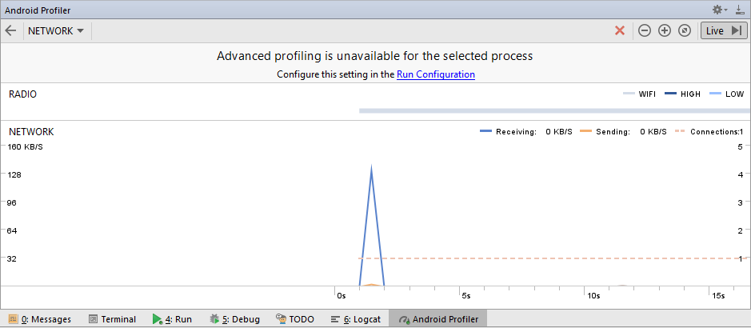
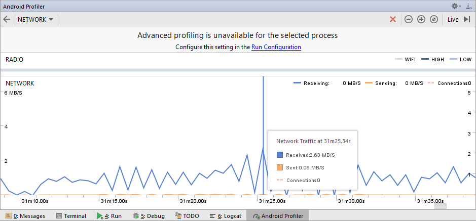
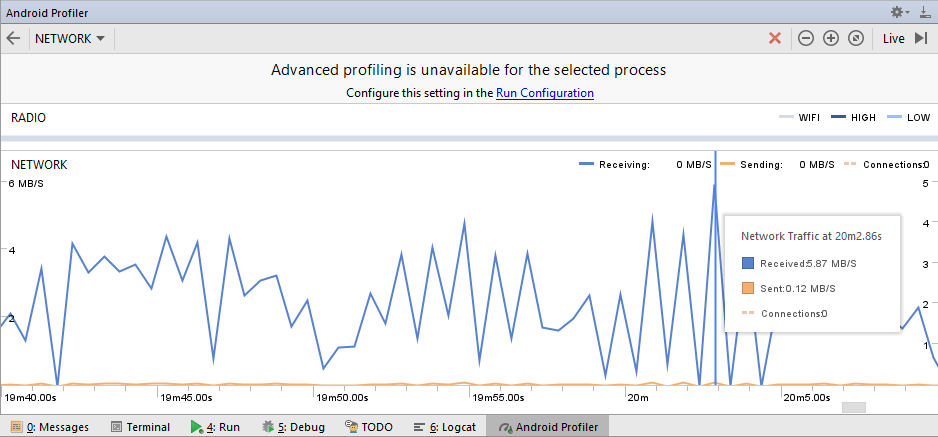

# Consumo de Rede

A análise dos testes foi realizada com um emulador do Nexus 4 utilizando a API 25.

## Download de Lista de Podcasts

Ao iniciar o app, é necessário realizar o download da lista de podcasts. O processo é relativamente rápido, apresentando pico em torno de 132 KB/s durante seu download, visto na imagem abaixo.



O download dessa lista é feita pela classe ItensDownloadIntentService, descrito pelo trecho de código abaixo.

```java
	
	public class ItensDownloadIntentService extends IntentService {
	    public static final String ACTION_ITENS_UPDATED = "br.ufpe.cin.if710.podcast.ItensUpdated";
	    public static final String DOWNLOAD_URL = "downloadURL";

	    public ItensDownloadIntentService(){
	        super("ItensDownloadIntentService");
	    }

	    @Override
	    protected void onHandleIntent(Intent intent) {
	        Log.d("KD scheduler service", "onHandleIntent: ");
	        try {
	            List<ItemFeed> itemList = XmlFeedParser.parse(getRssFeed(intent.getStringExtra(DOWNLOAD_URL)));
	            // salva itens no BD
	            PodcastProviderHelper.saveItens(getApplicationContext(), itemList);
	        } catch (IOException e) {
	            e.printStackTrace();
	        } catch (XmlPullParserException e) {
	            e.printStackTrace();
	        }

	        sendBroadcast(new Intent(ACTION_ITENS_UPDATED));
	    }

	    //TODO Opcional - pesquise outros meios de obter arquivos da internet
	    private String getRssFeed(String feed) throws IOException {
	        InputStream in = null;
	        String rssFeed = "";
	        try {
	            URL url = new URL(feed);
	            HttpURLConnection conn = (HttpURLConnection) url.openConnection();
	            in = conn.getInputStream();
	            ByteArrayOutputStream out = new ByteArrayOutputStream();
	            byte[] buffer = new byte[1024];
	            for (int count; (count = in.read(buffer)) != -1; ) {
	                out.write(buffer, 0, count);
	            }
	            byte[] response = out.toByteArray();
	            rssFeed = new String(response, "UTF-8");
	        } finally {
	            if (in != null) {
	                in.close();
	            }
	        }
	        return rssFeed;
	    }
	}
```

## Download de Podcasts

Para avaliar o consumo de rede pelo aplicativo, foram avaliados as ações de download individual e coletivo de podcasts, descritas nos itens seguintes.

### Download individual

Para avaliar o consumo de rede de download individual, foi realizado o download do episódio *Vida Extraterrestre: estamos sós no universo?*. O seu arquivo apresenta tamanho de 26.22 MB.
O download apresentou picos com máximo de 2.63 MB/s, como pode ser visto na imagem abaixo, ao longo de seu download e levou cerca de 55 segundos para sua conclusão.



O download individual de podcasts é feita pela classe DownloadIntentService auxiliado pelo DownloadManager do Android, visto no código abaixo.

```java
	
	public class DownloadIntentService extends IntentService {

	    public static final String ITEM_FEED = "itemFeed";

	    public DownloadIntentService(){
	        super("DownloadIntentService");
	    }

	    @Override
	    protected void onHandleIntent(Intent intent) {
	        Log.d("SERVICE", "intent");
	        ItemFeed itemFeed = (ItemFeed) intent.getSerializableExtra(ITEM_FEED);
	        // solicita o download manager do sistema para fazer o download do podcast
	        DownloadManager downloadManager = (DownloadManager) getApplicationContext().getSystemService(Context.DOWNLOAD_SERVICE);
	        // coloca o download numa fila e recupera seu ID para recuperar o arquivo posteriormente
	        // o proprio DownloadManager emite um broadcast quando termina o download
	        long downloadID = downloadManager.enqueue(new DownloadManager.Request(Uri.parse(itemFeed.getDownloadLink())));
	        // salva o ID no BD
	        PodcastProviderHelper.updateDownloadID(getApplicationContext(), itemFeed.getId(), downloadID);
	    }
	}
```

### Download coletivo

Para avaliar o consumo de rede de download coletivo, foi realizado o download simultâneo dos podcasts: *Objetos Voadores não identificados...* (26.44 MB), *Homeopatia* (18.55 MB), *Astrologia* (26.29 MB) e *Medicina Alternativa* (27.77 MB). Juntamente, seus downloads tiveram picos de 5.87 MB/s, visto na imagem abaixo, levando cerca de 1 minuto e 27 segundos para conclusão.

