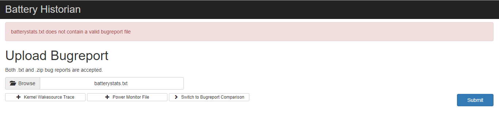

# Bateria

A avaliação do consumo de bateria foi realizado em dois dispositivos físicos: Moto G Play (Android 6.0) e Samsung Galaxy S7 (Android 7.0).

## Análise e Justificativa

Para analisar o consumo de bateria, foi utilizado como base o [guia de BatteryStats com Battery Historian](https://developer.android.com/studio/profile/battery-historian.html).

A análise feita no dispositivo com Android 6.0 não pode ser feita de maneira completa, visto que o aplicativo é dependente de *features* da API 25. Isto resultou em crashes durante interações com o aplicativo tais como:

1) Visualização das informações dos podcasts.

2) Reprodução de áudio de podcasts.

A análise feita no dispositivo com Android 7.0 foi feita executando as operações de:

1) Visualização das informações dos podcasts.

2) Download de podcasts.

3) Reprodução de áudio de podcasts.

4) Visualização da SettingsActivity.

Os *txt* dos relatórios de bateria foram gerados pelo Battery Stats. 
Visto que houve crashes na execução do aplicativo, os [relatórios gerados para o dispositivo com Android 6.0](https://github.com/betosousa/projetoif710/tree/master/Podcast/projectFilesMD/BatteryStats/Android_6.0) foram de tamanhos relativamente menores.

Os [relatórios gerados para o dispositivo com Android 7.0](https://github.com/betosousa/projetoif710/tree/master/Podcast/projectFilesMD/BatteryStats/Android_7.0) foram mais completos. Entretanto, para ambos dispositivos, os relatórios só podem ser visualizados de forma *raw*. O BatteryHistorian foi executado pelo DockerToolBox em sistema com Windows 10 Home.
O BatteryHistorian tem o propósito de converter os relatórios *raw* capturados para uma interpretação visual mais compreensível. Entretanto, para os relatórios gerados para este projeto, foi visualizado o seguinte comportamento do BatteryHistorian:

Isto pode ser justificado pela seguinte [issue](https://github.com/google/battery-historian/issues/90) no Github do BatteryHistorian.
Portanto, não se pôde tirar conclusões precisas em relação ao consumo de bateria, visto que não se foi possível visualizar os relatórios de uma forma mais compreensível.