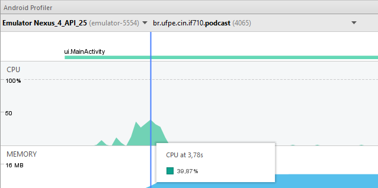

# CPU & Performance

A análise dos testes foi realizada com um emulador do Nexus 4 utilizando a API 25. Dividimos a avaliação de CPU e Performance em ações que representam os pricipais usos do app.

## Primeira inicialização do App

### Análise

Pelo que se pode perceber, o app registrou um pico de consumo de 39% da CPU durante o processo de primeira inicialização do app, momento este em que é realizado o primeiro download da lista de podcast.



Ao analisar o method trace dessa ação, percebe-se que o maior consumo da cpu ocorre nos metodos de inserção da lista no BD e de download do arquivo xml recebido pela internet.


Na inserção da lista, o content provider é chamado para cada item separadamente, o que pode ser melhorado com um bulkInsert.

```java

    public static void saveItens(Context context, List<ItemFeed> itemList){
        for (ItemFeed itemFeed : itemList) {
            ContentValues values = new ContentValues();
            // preenche um ContentValues com os dados recuperados no parser
            values.put(PodcastProviderContract.DATE, getValidString(itemFeed.getPubDate()));
            values.put(PodcastProviderContract.DESCRIPTION, getValidString(itemFeed.getDescription()));
            values.put(PodcastProviderContract.DOWNLOAD_LINK, getValidString(itemFeed.getDownloadLink()));
            values.put(PodcastProviderContract.EPISODE_LINK, getValidString(itemFeed.getLink()));
            values.put(PodcastProviderContract.TITLE, getValidString(itemFeed.getTitle()));
            // como o ep ainda nao foi baixado...
            values.put(PodcastProviderContract.EPISODE_URI, "");

            // salva o item no BD atraves de chamada ao Content Provider
            Uri uri = context.getContentResolver().insert(PodcastProviderContract.EPISODE_LIST_URI, values);
        }
    }


```


No download do xml, é estabelecida uma conexão com a url salva e a leitura dos bytes recebidos é feita atraves de um InputStream recuperado pela conexão. Uma possível melhora é utilizar o Download Manager para esta tarefa.

```java

    private String getRssFeed(String feed) throws IOException {
        InputStream in = null;
        String rssFeed = "";
        try {
            URL url = new URL(feed);
            HttpURLConnection conn = (HttpURLConnection) url.openConnection();
            in = conn.getInputStream();
            ByteArrayOutputStream out = new ByteArrayOutputStream();
            byte[] buffer = new byte[1024];
            for (int count; (count = in.read(buffer)) != -1; ) {
                out.write(buffer, 0, count);
            }
            byte[] response = out.toByteArray();
            rssFeed = new String(response, "UTF-8");
        } finally {
            if (in != null) {
                in.close();
            }
        }
        return rssFeed;
    }

```


### Correções

Para melhorar essa performance de inserção, utilizamos o bulk insert ...

[    imagem  mTraceAbrirAppInsertCorrigido    ]:<> 


Para melhorar a performance de download, utilizamos o Download Manager ...

[    imagem  mTraceAbrirAppReadCorrigido    ]:<> 


## Download de Episódio

### Analise

Pelo que se pode perceber, o app registrou um pico de consumo de 12% da CPU no instante em que recebe o comando de download de um episódio. Por mais que vários downloads sejam socilitados simultaneamente, o consumo da CPU permanece nessa faixa de 12%.

[//]:<> (add img profile cpu)

### Justificativa

Quando o usuário solicita um download, o app chama um IntentService para concluir a ação. Este por sua vez, chama o download manager do próprio sistema, dessa forma, o consumo de CPU necessário ao download se dá pelo sistema e não pelo app. 

```java

public class DownloadIntentService extends IntentService {

    public static final String ITEM_FEED = "itemFeed";

    public DownloadIntentService(){
        super("DownloadIntentService");
    }

    @Override
    protected void onHandleIntent(Intent intent) {
        Log.d("SERVICE", "intent");
        ItemFeed itemFeed = (ItemFeed) intent.getSerializableExtra(ITEM_FEED);
        // solicita o download manager do sistema para fazer o download do podcast
        DownloadManager downloadManager = (DownloadManager) getApplicationContext().getSystemService(Context.DOWNLOAD_SERVICE);
        // coloca o download numa fila e recupera seu ID para recuperar o arquivo posteriormente
        // o proprio DownloadManager emite um broadcast quando termina o download
        long downloadID = downloadManager.enqueue(new DownloadManager.Request(Uri.parse(itemFeed.getDownloadLink())));
        // salva o ID no BD
        PodcastProviderHelper.updateDownloadID(getApplicationContext(), itemFeed.getId(), downloadID);
    }
}

```

## Reproduzir Podcast

[//]:<> (TODO)
