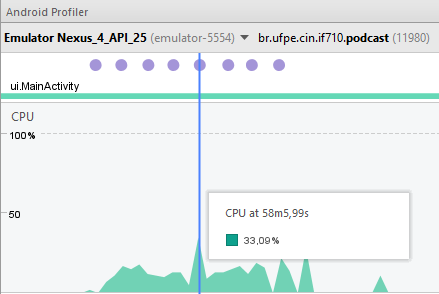

# CPU & Performance

A análise dos testes foi realizada com um emulador do Nexus 4 utilizando a API 25. Dividimos a avaliação de CPU e Performance em ações que representam os pricipais usos do app.

## Primeira inicialização do App

### Análise

Pelo que se pode perceber, o app registrou um pico de consumo de 39% da CPU durante o processo de primeira inicialização do app, momento este em que é realizado o primeiro download da lista de podcast.


Ao analisar o method trace dessa ação, percebe-se que o maior consumo da cpu ocorre nos métodos de inserção da lista no BD e de download do arquivo xml recebido pela internet.


### Justificativa

Na inserção da lista, o content provider é chamado para cada item separadamente, o que pode ser melhorado com um bulkInsert.

```java

    public static void saveItens(Context context, List<ItemFeed> itemList){
        for (ItemFeed itemFeed : itemList) {
            ContentValues values = new ContentValues();
            // preenche um ContentValues com os dados recuperados no parser
            values.put(PodcastProviderContract.DATE, getValidString(itemFeed.getPubDate()));
            values.put(PodcastProviderContract.DESCRIPTION, getValidString(itemFeed.getDescription()));
            values.put(PodcastProviderContract.DOWNLOAD_LINK, getValidString(itemFeed.getDownloadLink()));
            values.put(PodcastProviderContract.EPISODE_LINK, getValidString(itemFeed.getLink()));
            values.put(PodcastProviderContract.TITLE, getValidString(itemFeed.getTitle()));
            // como o ep ainda nao foi baixado...
            values.put(PodcastProviderContract.EPISODE_URI, "");

            // salva o item no BD atraves de chamada ao Content Provider
            Uri uri = context.getContentResolver().insert(PodcastProviderContract.EPISODE_LIST_URI, values);
        }
    }


```


No download do xml, é estabelecida uma conexão com a url salva e a leitura dos bytes recebidos é feita através de um InputStream recuperado pela conexão. 

```java

    private String getRssFeed(String feed) throws IOException {
        InputStream in = null;
        String rssFeed = "";
        try {
            URL url = new URL(feed);
            HttpURLConnection conn = (HttpURLConnection) url.openConnection();
            in = conn.getInputStream();
            ByteArrayOutputStream out = new ByteArrayOutputStream();
            byte[] buffer = new byte[1024];
            for (int count; (count = in.read(buffer)) != -1; ) {
                out.write(buffer, 0, count);
            }
            byte[] response = out.toByteArray();
            rssFeed = new String(response, "UTF-8");
        } finally {
            if (in != null) {
                in.close();
            }
        }
        return rssFeed;
    }

```


### Correção

Para melhorar essa performance de inserção, utilizamos o bulk insert. Assim, criamos um método novo na classe PodcastProvider (classe que extende ContentProvider) para realizar o bulk insert.

```java

    @Override
    public int bulkInsert(Uri uri, ContentValues[] valuesArray){
        int total = 0;
        if(isEpisodeTableUri(uri)) {
            // recupera o bd para insercao
            SQLiteDatabase db = dbHelper.getWritableDatabase();
            // inicia a transacao do bulkInsert
            db.beginTransaction();
            try {
                // itera sobre o array de ContentValues realizando os inserts e atualizando o total inserido
                for (ContentValues value : valuesArray) {
                    db.insert(PodcastDBHelper.DATABASE_TABLE, null, value);
                    total++;
                }
                // se tudo der certo...
                db.setTransactionSuccessful();
            } finally {
                // se algo der errado, finaliza a transacao
                db.endTransaction();
            }
        }
        // retorna o total de linhas inseridas
        return total;
    }
```

Com isso, adaptamos o método PodcastProviderHelper.saveItens(Context context, List<ItemFeed> itemList) para chamar o bulk insert caso a lista passada tenha mais de 1 elemento.

```java


    public static void saveItens(Context context, List<ItemFeed> itemList) {
        ContentValues[] valuesArray = new ContentValues[itemList.size()];
        for (int i = 0; i < itemList.size(); i++) {
            ItemFeed itemFeed = itemList.get(i);
            ContentValues values = new ContentValues();
            // preenche um ContentValues com os dados recuperados no parser
            values.put(PodcastProviderContract.DATE, getValidString(itemFeed.getPubDate()));
            values.put(PodcastProviderContract.DESCRIPTION, getValidString(itemFeed.getDescription()));
            values.put(PodcastProviderContract.DOWNLOAD_LINK, getValidString(itemFeed.getDownloadLink()));
            values.put(PodcastProviderContract.EPISODE_LINK, getValidString(itemFeed.getLink()));
            values.put(PodcastProviderContract.TITLE, getValidString(itemFeed.getTitle()));
            // como o ep ainda nao foi baixado...
            values.put(PodcastProviderContract.EPISODE_URI, "");
            valuesArray[i] = values;
        }
        if (itemList.size() > 1) {
            // salva os itens no BD atraves de chamada ao Content Provider
            context.getContentResolver().bulkInsert(PodcastProviderContract.EPISODE_LIST_URI, valuesArray);
        } else {
            // salva o item no BD atraves de chamada ao Content Provider
            Uri uri = context.getContentResolver().insert(PodcastProviderContract.EPISODE_LIST_URI, valuesArray[0]);
        }
    }
```

## Download de Episódio

### Análise

Pelo que se pode perceber, o app registrou um pico de consumo de 20% da CPU no instante em que recebe o comando de download de um episódio. Por mais que vários downloads sejam socilitados simultaneamente, o consumo da CPU se manteve numa média de 20% com pico de 33%.

Único download:


Download múltiplo:




### Justificativa

Quando o usuário solicita um download, o app chama um IntentService para concluir a ação. Este por sua vez, chama o download manager do próprio sistema, dessa forma, o consumo de CPU necessário ao download se dá pelo sistema e não pelo app. 

```java

public class DownloadIntentService extends IntentService {

    public static final String ITEM_FEED = "itemFeed";

    public DownloadIntentService(){
        super("DownloadIntentService");
    }

    @Override
    protected void onHandleIntent(Intent intent) {
        Log.d("SERVICE", "intent");
        ItemFeed itemFeed = (ItemFeed) intent.getSerializableExtra(ITEM_FEED);
        // solicita o download manager do sistema para fazer o download do podcast
        DownloadManager downloadManager = (DownloadManager) getApplicationContext().getSystemService(Context.DOWNLOAD_SERVICE);
        // coloca o download numa fila e recupera seu ID para recuperar o arquivo posteriormente
        // o proprio DownloadManager emite um broadcast quando termina o download
        long downloadID = downloadManager.enqueue(new DownloadManager.Request(Uri.parse(itemFeed.getDownloadLink())));
        // salva o ID no BD
        PodcastProviderHelper.updateDownloadID(getApplicationContext(), itemFeed.getId(), downloadID);
    }
}

```

## Reproduzir Podcast

### Análise

Durante a ação de reprodução do episódio, percebemos um pico de uso de 20% da cpu pelo app para abrir a activity reponsável pela reprodução do episódio. 


### Justificativa

Nesta activity ocorre a criação e o bind do service que reproduzirá a mídia. 

```java

        // cria intent para chamar o service
        Intent serviceIntent = new Intent(getApplicationContext(), PodcastPlayer.class);
        // inicia o service para reproduzir o podcast
        startService(serviceIntent);

```

```java

        // cria intent para realizar bind com service
        Intent bindIntent = new Intent(getApplicationContext(), PodcastPlayer.class);
        // passa podcast a ser reproduzido pelo service
        bindIntent.putExtra(PODCAST, podcast);
        // realiza bind com service
        isBound = bindService(bindIntent, serviceConnection, BIND_AUTO_CREATE);
```

Neste service, o processamento da reprodução é feito pelo mediaPlayer. 

```java

public IBinder onBind(Intent intent) {
        podcast = (ItemFeed) intent.getSerializableExtra(PODCAST);
        mediaPlayer = MediaPlayer.create(getApplicationContext(), Uri.parse(podcast.getFileURI()));
        [...]
        // inicializa de onde parou
        mediaPlayer.seekTo(podcast.getPlayedMsec());
        [...]

```

Com isso é possível sair da activity sem parar a reprodução e assim, o profiler registra 0% de uso da CPU pelo app e em média 20% como sendo de outros (enquanto o podcast está sendo tocado pelo mediaPlayer).


