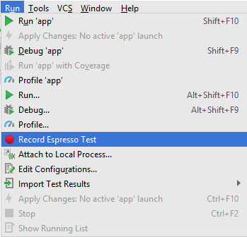

# Testes

Os testes foram especificados antes da refatorção para uso de Room e Architecture components.

## Unitários (JUnit)

Nesta etapa, iremos definir uma suite de testes para as operações de CRUD definidas na classe PodcastProviderHelper, que trata objetos do tipo ItemFeed, principal classe do modelo e que representa um podcast salvo no app.

Para isso, implementamos a classe JUnitTestSuite no pacote androidTest porque precisamos do contexto da aplicação para testar o BD.

Esta classe possui os seguintes atributos:

```java
    
    private static final long DOWNLOAD_ID = 10;
    private static final int ITEM_ID = 1;
    static Context context;
    static ItemFeed itemFeed;
    int itensTotal;
```

Os métodos da classe seram explicados a seguir.

### beforeClass()

Neste método colocamos tudo que fosse necessário e comum a todos os testes.

```java

    @BeforeClass
    public static void beforeClass() {
        // recupera o contexto do app
        context = InstrumentationRegistry.getTargetContext();

        List<ItemFeed> listaItens = new ArrayList<>();
        Date data = new Date();
        itemFeed = new ItemFeed(ITEM_ID, "titulo", "link Podcast", data.toString(), "descricao", "download url");
        // define um downloadID para ser recuperado no teste de leitura 
        itemFeed.setDownloadID(DOWNLOAD_ID);
        listaItens.add(itemFeed);
        // salva um item no bd inicialmente
        PodcastProviderHelper.saveItens(context, listaItens);
    }
```

### beforeTests()

Neste método atualizamos tudo que precisa ser inicializado antes de cada teste

```java

    @Before
    public void beforeTests() {
        // antes de cada teste atualiza o total de itens salvo no bd
        itensTotal = PodcastProviderHelper.getItens(context).size();
    }
```

### Inserção

Aqui testamos a inserção de um item no bd. Para validar, comparamos o total de itens salvos após a operação com o a quantidade antes do teste somada ao total inserido.

```java

    @Test
    public void insertTest() {
        // cria objeto a ser inserido
        ItemFeed itemFeed = new ItemFeed(ITEM_ID + 1, "title", "link", "date", "teste", "downloadLink");

        // insere objeto
        List<ItemFeed> lista = new ArrayList<>();
        lista.add(itemFeed);
        PodcastProviderHelper.saveItens(context, lista);
        
        // testa se a quantitade de itens salvos corresponde ao esperado
        assertEquals(lista.size() + itensTotal, PodcastProviderHelper.getItens(context).size());
    }
```

### Busca

Aqui testamos a busca de um item no bd. Como possuímos dois métodos para recuperar os itens salvos, criamos dois testes. 

#### Busca simples

Aqui criamos um teste para verificar a busca de um único item salvo no método beforeClass(). Para validar, verificamos se o id do objeto recuperado é igual ao do objeto salvo no método inicial.

```java

    @Test
    public void leituraSimplesTest(){
        // recupera item salvo previamente
        ItemFeed item = PodcastProviderHelper.getItem(context, DOWNLOAD_ID);
        // testa se os ids sao iguais
        assertEquals(itemFeed.getId(), item.getId());
    }
```

#### Busca de lista

Aqui criamos um teste para verificar a busca de todos os itens salvos no BD. Para validar, verificamos se a lista recuperada tem a mesma quantidade de elementos salvo no BD (valor armazenado na varivel itensTotal, que é atualizada antes de cada teste).

```java

    @Test
    public void leituraListaTest(){
        // recupera itens salvos no BD
        List<ItemFeed> lista = PodcastProviderHelper.getItens(context);
        // testa se a lista tem o tamnho certo
        assertEquals(itensTotal, lista.size());
    }
```


### Atualização

Aqui testamos a atualização de um item no bd. Como possuímos três métodos para atualizar atributos dos itens salvos, criamos três testes. 

#### Atributo DownloadId

Aqui testamos o método PodcastProviderHelper.updateDownloadID(Context context, int podcastID, long downloadID) que atualiza o atributo DownloadId do item de id passado. Para validar, como buscamos apenas por esse mesmo atributo, verificamos se os Ids passados e buscados são iguais.

```java

    @Test
    public void updateDownloadIdTest(){
        // atualiza o download id
        PodcastProviderHelper.updateDownloadID(context, ITEM_ID, DOWNLOAD_ID + 1);
        //busca o item
        ItemFeed item = PodcastProviderHelper.getItem(context, DOWNLOAD_ID + 1);
        // verifica se os itens tem o mesmo ID
        assertEquals(ITEM_ID, item.getId());
    }
```

#### Atributo FileURI

Aqui testamos o método PodcastProviderHelper.updateFileURI(Context context, int podcastID, String fileURI) que atualiza o atributo FileURI do item de id passado. Para validar, verificamos se as strings passada e buscada são iguais.

```java
    
    @Test
    public void updateFileUriTest(){
        // atualiza a uri do podcast
        PodcastProviderHelper.updateFileURI(context, ITEM_ID, "new file uri");
        // busca o item
        ItemFeed item = PodcastProviderHelper.getItem(context, DOWNLOAD_ID);
        // verifica se o iten tem o mesmo fileURI
        assertEquals("new file uri", item.getFileURI());
    }
```

#### Atributo PlayedMsec

Aqui testamos o método PodcastProviderHelper.updatePlayedMsec(Context context, int podcastID, int playedMsec) que atualiza o atributo PlayedMsec do item de id passado. Para validar, verificamos se os inteiros passado e buscado são iguais.

```java

    @Test
    public void updatePlayedMsecTest(){
        // atualiza o valor de playedMsec
        PodcastProviderHelper.updatePlayedMsec(context, ITEM_ID, 100);
        // busca o item
        ItemFeed item = PodcastProviderHelper.getItem(context, DOWNLOAD_ID);
        // verifica se o iten tem o mesmo valor de playedMsec
        assertEquals(100, item.getPlayedMsec());
    }
```

## Integração (UI - Espresso)

Nesta etapa, foi definida uma suíte de testes feita eplo Espresso para avaliar integração e interface. 

### Espresso Test Recorder

Por motivos de facilidade e organização do código de testes gerado, foi utilizado a ferramenta provida pelo Android Studio, o Espresso Test Recorder.



Com esta ferramenta, nos é disponibilizado uma interface que registra as ações realizadas pelo emulador, tais como os cliques e acessos às diferentes componentes presentes no aplicativo, etc. 

### Descrição

Para cada interação feita com o emulador, é possível adicionar *assertions* que verificam se o que é disponibilizado pelo app é condizente com o que é esperado.
Baseado nas *assertions* definidas, é gerado automaticamente código correspondente aquilo, como pode ser visto abaixo pela imagem descrevendo a interface do Espresso Test Recorder e o código gerado baseado na *assertion* feita.


```java

    DataInteraction linearLayout = onData(anything())
            .inAdapterView(allOf(withId(R.id.items),
                    childAtPosition(
                            withClassName(is("android.widget.LinearLayout")),
                            0)))
            .atPosition(0);
    linearLayout.perform(click());

    ViewInteraction textView = onView(
            allOf(withId(R.id.podcastitle), withText("O Homem foi mesmo até a Lua?"),
                    childAtPosition(
                            childAtPosition(
                                    withId(android.R.id.content),
                                    0),
                            0),
                    isDisplayed()));
    textView.check(matches(withText("O Homem foi mesmo até a Lua?")));
```

As ações escolhidas sequencialmente para a nossa suite de testes de integração e interface foram (todas os trechos de código abaixo são referentes ao segundo item da lista de podcasts, em que o episódio correspondente é o de *Darwin e a Evolução*):

1) Realizar clique em itens da lista de episódios de podcast.

```java

    DataInteraction linearLayout2 = onData(anything())
            .inAdapterView(allOf(withId(R.id.items),
                    childAtPosition(
                            withClassName(is("android.widget.LinearLayout")),
                            0)))
            .atPosition(1);
    linearLayout2.perform(click());
```

2) Verificar as informações que são disponibilizadas pelas activities novas carregadas.

```java

    ViewInteraction textView2 = onView(
            allOf(withId(R.id.podcastitle), withText("Darwin e a Evolução"),
                    childAtPosition(
                            childAtPosition(
                                    withId(android.R.id.content),
                                    0),
                            0),
                    isDisplayed()));
    textView2.check(matches(withText("Darwin e a Evolução")));

    ViewInteraction textView3 = onView(
            allOf(withId(R.id.pubDate), withText("Mon, 21 Jun 2010 10:45:05 GMT"),
                    childAtPosition(
                            childAtPosition(
                                    withId(android.R.id.content),
                                    0),
                            1),
                    isDisplayed()));
    textView3.check(matches(withText("Mon, 21 Jun 2010 10:45:05 GMT")));

    ViewInteraction textView4 = onView(
            allOf(withId(R.id.description), withText("Programa 3"),
                    childAtPosition(
                            childAtPosition(
                                    withId(android.R.id.content),
                                    0),
                            2),
                    isDisplayed()));
    textView4.check(matches(withText("Programa 3")));
```

3) Verificar a existência do botão de download do episódio antes de realizar o download.

```java

    ViewInteraction button = onView(
            allOf(withId(R.id.item_action),
                    childAtPosition(
                            childAtPosition(
                                    IsInstanceOf.<View>instanceOf(android.widget.LinearLayout.class),
                                    0),
                            1),
                    isDisplayed()));
    button.check(matches(isDisplayed()));

    ViewInteraction button2 = onView(
            allOf(withId(R.id.item_action), withText("BAIXAR"),
                    childAtPosition(
                            childAtPosition(
                                    withClassName(is("android.widget.LinearLayout")),
                                    0),
                            1),
                    isDisplayed()));
    button2.perform(click());
```

4) Realizar clique, quando o download do episódio é finalizado, em botão que tem seu texto modificado de **BAIXAR** para **REPRODUZIR**.

```java

    ViewInteraction button5 = onView(
            allOf(withId(R.id.item_action), withText("REPRODUZIR"),
                    childAtPosition(
                            childAtPosition(
                                    withClassName(is("android.widget.LinearLayout")),
                                    0),
                            1),
                    isDisplayed()));
    button5.perform(click());
```

5) Verificar informações em nova activity (PlayActivity) carregada do episódio que se deseja reproduzir o aúdio.

```java

    ViewInteraction textView5 = onView(
            allOf(withId(R.id.playtitle), withText("Darwin e a Evolução"),
                    childAtPosition(
                            childAtPosition(
                                    withId(android.R.id.content),
                                    0),
                            0),
                    isDisplayed()));
    textView5.check(matches(withText("Darwin e a Evolução")));
```

6) Verificar a existência dos botões de **PLAY** e **PAUSE** na PlayActivity.

```java

    ViewInteraction button6 = onView(
            allOf(withId(R.id.play),
                    childAtPosition(
                            childAtPosition(
                                    IsInstanceOf.<View>instanceOf(android.widget.LinearLayout.class),
                                    1),
                            0),
                    isDisplayed()));
    button6.check(matches(isDisplayed()));

    ViewInteraction button7 = onView(
            allOf(withId(R.id.pause),
                    childAtPosition(
                            childAtPosition(
                                    IsInstanceOf.<View>instanceOf(android.widget.LinearLayout.class),
                                    1),
                            1),
                    isDisplayed()));
    button7.check(matches(isDisplayed()));
```

7) Realizar clique nos botões de **PLAY** e **PAUSE**.

```java

    ViewInteraction button8 = onView(
            allOf(withId(R.id.play), withText("PLAY"),
                    childAtPosition(
                            childAtPosition(
                                    withClassName(is("android.widget.LinearLayout")),
                                    1),
                            0),
                    isDisplayed()));
    button8.perform(click());

    ViewInteraction button9 = onView(
            allOf(withId(R.id.pause), withText("PAUSE"),
                    childAtPosition(
                            childAtPosition(
                                    withClassName(is("android.widget.LinearLayout")),
                                    1),
                            1),
                    isDisplayed()));
    button9.perform(click());
```

###### Rascunho inicial

-> acrescentar ajustes depois do crash de varios downloads simultaneos.
